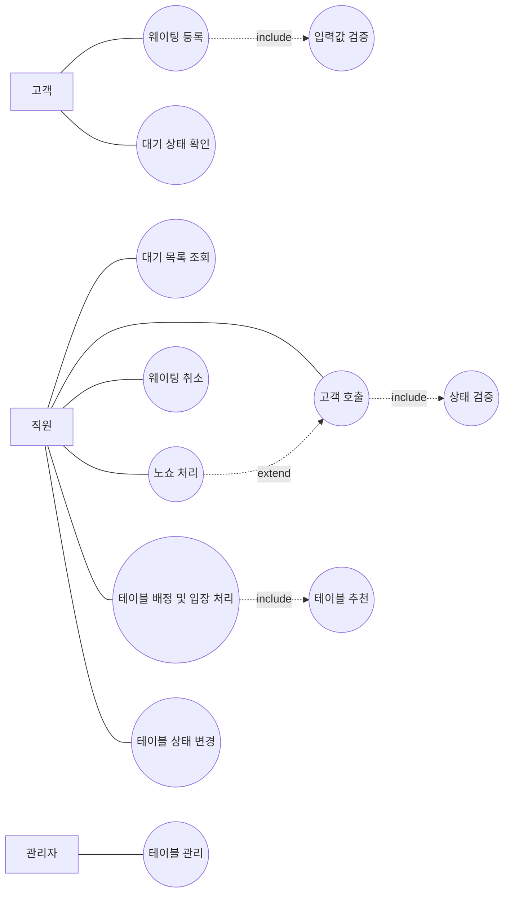

# 02. 유스케이스 모델

## 1. 액터

| Actor | 설명 |
|---|---|
| 고객 | 웨이팅을 등록하고 자신의 대기 상태를 확인하는 사용자 |
| 직원 | 고객 호출, 취소, 노쇼, 입장 처리를 수행하는 사용자 |
| 관리자 | 테이블 정보를 등록하고 관리하는 사용자 |

## 2. 유스케이스 목록

| ID | 유스케이스 | 주 액터 | 설명 |
|---|---|---|---|
| UC-01 | 웨이팅 등록 | 고객 | 고객이 이름, 연락처, 인원수를 입력하여 웨이팅을 등록한다. |
| UC-02 | 대기 상태 확인 | 고객 | 고객이 자신의 대기 번호와 상태를 확인한다. |
| UC-03 | 대기 목록 조회 | 직원 | 직원이 현재 대기 고객 목록을 조회한다. |
| UC-04 | 고객 호출 | 직원 | 직원이 `waiting` 상태 고객을 `called` 상태로 변경한다. |
| UC-05 | 웨이팅 취소 | 직원 | 직원이 고객의 웨이팅을 취소 처리한다. |
| UC-06 | 노쇼 처리 | 직원 | 직원이 호출 후 오지 않은 고객을 `no-show` 상태로 변경한다. |
| UC-07 | 테이블 배정 및 입장 처리 | 직원 | 직원이 고객에게 테이블을 배정하고 입장 처리한다. |
| UC-08 | 테이블 관리 | 관리자 | 관리자가 테이블 번호와 수용 인원을 등록/수정한다. |
| UC-09 | 테이블 상태 변경 | 직원 | 직원이 테이블을 사용 가능, 사용 중, 청소 중 상태로 변경한다. |

## 3. 유스케이스 관계

| 관계 | 설명 |
|---|---|
| `웨이팅 등록` includes `입력값 검증` | 등록 전 이름, 연락처, 인원수 검증이 필요하다. |
| `고객 호출` includes `상태 검증` | waiting 상태 고객만 호출할 수 있다. |
| `테이블 배정 및 입장 처리` includes `테이블 추천` | 고객 인원수에 맞는 테이블을 먼저 찾아야 한다. |
| `노쇼 처리` extends `고객 호출` | 고객 호출 후 오지 않는 경우에만 발생한다. |

## 4. 유스케이스 다이어그램

## 5. 주요 유스케이스 상세 명세

### UC-01. 웨이팅 등록

| 항목 | 내용 |
|---|---|
| 주 액터 | 고객 |
| 사전 조건 | 시스템이 실행 중이어야 한다. |
| 사후 조건 | 고객이 `waiting` 상태로 등록된다. |
| 관련 요구사항 | FR-01, FR-02, FR-03, FR-04 |

#### 기본 흐름
1. 고객이 웨이팅 등록 화면을 연다.
2. 고객이 이름, 연락처, 인원수, 요청사항을 입력한다.
3. 시스템이 입력값을 검증한다.
4. 시스템이 대기 번호를 생성한다.
5. 시스템이 고객 상태를 `waiting`으로 저장한다.
6. 시스템이 등록 완료 결과를 표시한다.

#### 예외 흐름
- 인원수가 1보다 작으면 등록하지 않고 오류 메시지를 표시한다.
- 필수 입력값이 비어 있으면 등록하지 않고 오류 메시지를 표시한다.

---

### UC-04. 고객 호출

| 항목 | 내용 |
|---|---|
| 주 액터 | 직원 |
| 사전 조건 | 고객 상태가 `waiting`이어야 한다. |
| 사후 조건 | 고객 상태가 `called`로 변경된다. |
| 관련 요구사항 | FR-05, FR-06 |

#### 기본 흐름
1. 직원이 대기 목록을 조회한다.
2. 직원이 호출할 고객을 선택한다.
3. 시스템이 고객 상태를 확인한다.
4. 시스템이 고객 상태를 `called`로 변경한다.
5. 시스템이 변경된 목록을 표시한다.

#### 예외 흐름
- 고객 상태가 `waiting`이 아니면 호출할 수 없다는 메시지를 표시한다.

---

### UC-07. 테이블 배정 및 입장 처리

| 항목 | 내용 |
|---|---|
| 주 액터 | 직원 |
| 사전 조건 | 고객 상태가 `called`이고 사용 가능한 테이블이 존재해야 한다. |
| 사후 조건 | 고객 상태는 `seated`, 테이블 상태는 `occupied`가 된다. |
| 관련 요구사항 | FR-10, FR-11, FR-12 |

#### 기본 흐름
1. 직원이 `called` 상태 고객을 선택한다.
2. 시스템이 고객 인원수에 맞는 `available` 테이블을 찾는다.
3. 시스템이 적절한 테이블을 추천한다.
4. 직원이 테이블 배정을 확정한다.
5. 시스템이 고객 상태를 `seated`로 변경한다.
6. 시스템이 테이블 상태를 `occupied`로 변경한다.
7. 시스템이 입장 완료 결과를 표시한다.

#### 예외 흐름
- 적절한 테이블이 없으면 배정 불가 메시지를 표시한다.
- 사용 중인 테이블을 선택하면 배정하지 않고 오류 메시지를 표시한다.
