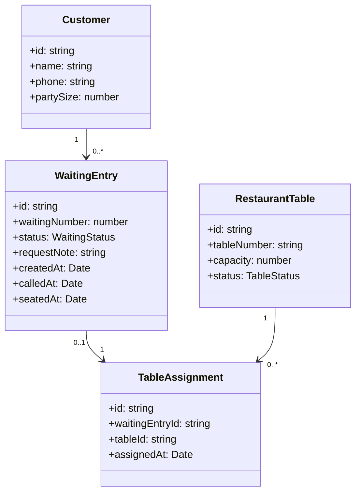

# 03. 도메인 모델

## 1. 도메인 개념

| 개념 | 설명 |
|---|---|
| Customer | 웨이팅을 등록한 고객 |
| WaitingEntry | 고객의 웨이팅 정보와 현재 상태 |
| RestaurantTable | 음식점의 테이블 정보와 현재 상태 |
| Staff | 고객 상태와 테이블 상태를 처리하는 직원 |
| TableAssignment | 고객과 테이블의 배정 관계 |

## 2. 도메인 사전

| 용어 | 의미 |
|---|---|
| waiting | 고객이 입장을 기다리는 상태 |
| called | 직원이 고객을 호출한 상태 |
| seated | 고객이 테이블에 입장한 상태 |
| cancelled | 웨이팅이 취소된 상태 |
| no-show | 호출 후 고객이 오지 않은 상태 |
| available | 테이블 사용 가능 상태 |
| occupied | 테이블 사용 중 상태 |
| cleaning | 테이블 정리 중 상태 |

## 3. 핵심 비즈니스 규칙

| ID | 규칙 |
|---|---|
| BR-01 | 웨이팅 등록 시 고객 상태는 `waiting`으로 시작한다. |
| BR-02 | `waiting` 상태 고객만 `called` 상태로 변경할 수 있다. |
| BR-03 | `called` 상태 고객만 입장 처리할 수 있다. |
| BR-04 | 입장 처리 시 고객 상태는 `seated`, 테이블 상태는 `occupied`가 된다. |
| BR-05 | `cancelled` 또는 `no-show` 상태 고객은 입장 처리할 수 없다. |
| BR-06 | 고객 인원수보다 수용 인원이 작은 테이블은 추천하지 않는다. |
| BR-07 | `available` 상태 테이블만 배정할 수 있다. |
| BR-08 | 고객 인원수를 수용할 수 있는 테이블 중 가장 작은 테이블을 우선 추천한다. |
| BR-09 | `occupied` 테이블은 식사 종료 후 `cleaning`으로 변경할 수 있다. |
| BR-10 | `cleaning` 테이블은 청소 완료 후 `available`로 변경할 수 있다. |

## 4. 개념 클래스 모델



## 5. 구현 시 참고할 데이터 구조 예시

```js
const waitingEntry = {
  id: "w1",
  waitingNumber: 1,
  name: "Kim",
  phone: "010-0000-0000",
  partySize: 3,
  requestNote: "창가 자리 선호",
  status: "waiting",
  createdAt: "2026-05-26T12:00:00"
};

const table = {
  id: "t1",
  tableNumber: "A1",
  capacity: 4,
  status: "available"
};
```

## 6. 도메인 모델링 결과

본 시스템은 `Customer`, `WaitingEntry`, `RestaurantTable`을 중심으로 구성된다.  
구현에서는 이 세 개념을 기준으로 컴포넌트와 상태 관리 로직을 분리하면 된다.
