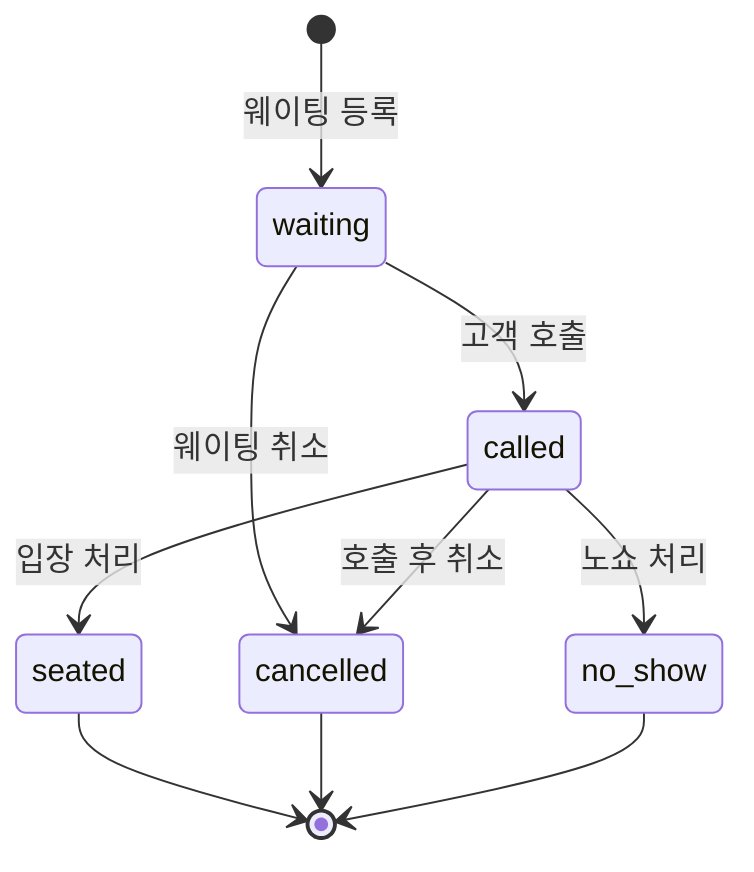
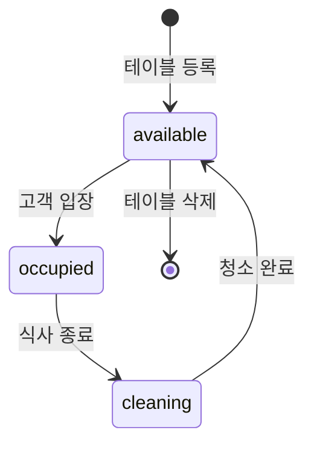
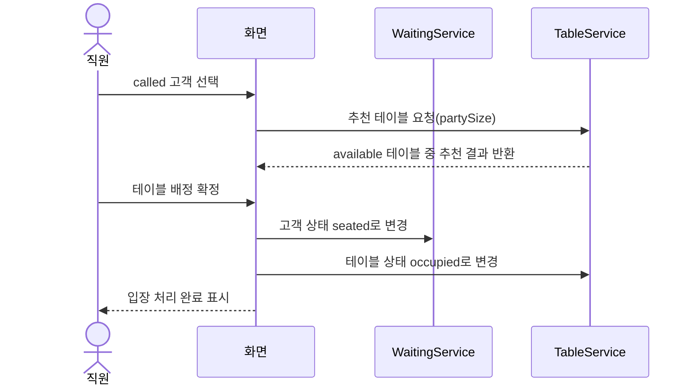
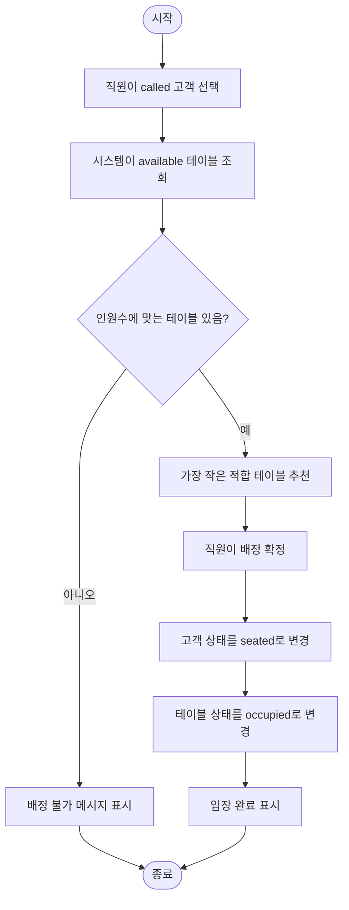

# 04. 동적 모델링

## 1. 고객 상태 모델

## 2. 테이블 상태 모델

## 3. 입장 처리 시퀀스 다이어그램

## 4. 입장 처리 액티비티 다이어그램

## 5. 동적 모델링 결과

동적 모델링을 통해 다음 점을 명확히 했다.

1. 고객은 아무 상태로든 자유롭게 이동하지 않는다.
2. `waiting → called → seated`가 기본 입장 흐름이다.
3. `cancelled`, `no-show`는 종료 상태로 보고 이후 입장 처리하지 않는다.
4. 테이블은 `available`일 때만 고객에게 배정된다.
5. 입장 처리는 고객 상태와 테이블 상태를 동시에 바꾸는 핵심 기능이다.
